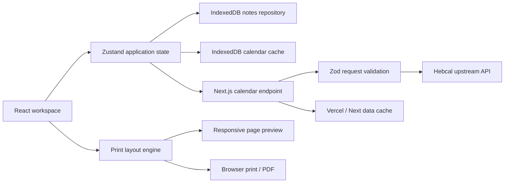

# Hebrew Calendar Studio — Next.js Architecture

## 1. Status

- Decision status: approved for implementation
- Architecture style: modular monolith
- Framework: Next.js 16 App Router with React 19 and strict TypeScript
- Runtime: Node.js 22 on Vercel
- Deployment scope: `YakirBM2026`
- Primary locale: Hebrew (`he-IL`), right-to-left

## 2. Product intent

Hebrew Calendar Studio creates accurate, customizable Gregorian/Hebrew calendar
grids for A4 and A3 PDF printing. The application must remain useful on desktop,
phone, and tablet; preserve equal calendar cells; avoid clipped text; support
portrait and landscape output; and permit personal notes without sending those
notes to a server.

The migration replaces the single-file implementation with a maintainable
Next.js application. The migration is architectural, not a product reset: all
verified calendar, print, overflow, offline-cache, note, and RTL behavior remains
part of the acceptance baseline.

## 3. Assumptions and non-functional requirements

- Modern browsers: Chrome/Edge/Firefox 111+, Safari 16.4+.
- Responsive support starts at a 320 px viewport; the validated product target
  starts at 360 px and includes tablets and desktop.
- Interactive controls expose at least a 44 px target on iOS and 48 px on
  Android-sized layouts.
- The preview responds within one animation frame for visual-only settings and
  presents explicit progress for network work.
- A calendar range is limited to three years.
- Personal notes and imported custom events are private client data.
- No account system, database, analytics SDK, or advertising is introduced.
- Availability depends on Vercel and Hebcal; a verified IndexedDB cache provides
  graceful degradation for previously loaded ranges.
- `main` is the production branch. Vercel Preview is used before production.

## 4. Architectural approach

The system is a modular monolith. Business rules remain framework-independent;
Next.js provides routing, the server boundary, metadata, and deployment.



## 5. Bounded contexts

### Calendar domain

Owns date-range alignment, weekday ordering, Hebrew-date display rules, event
classification, visibility policy, and day view models. It has no React, browser,
or Next.js dependencies.

### Print layout

Owns paper dimensions, orientation, pagination, density profiles, equal-cell
geometry, auto-sizing, overflow status, and print metadata. It is expressed as
pure functions so that browser and unit tests use the same calculations.

### Calendar data

Owns the Hebcal contract, server fetch, response normalization, timeouts,
upstream errors, and cached client fallback. The UI never understands raw Hebcal
categories.

### Personalization

Owns settings, design presets, custom events, personal notes, legacy localStorage
migration, project import/export, and reset behavior.

### Workspace UI

Owns responsive composition, forms, status feedback, the settings sheet, preview,
day editor, touch and keyboard behavior, and print invocation.

## 6. Proposed source structure

```text
src/
  app/
    api/calendar/route.ts
    error.tsx
    globals.css
    icon.tsx
    layout.tsx
    loading.tsx
    manifest.ts
    page.tsx
  application/
    calendar/use-calendar-controller.ts
    projects/project-file.ts
  components/
    calendar/calendar-page.tsx
    calendar/calendar-preview.tsx
    calendar/day-cell.tsx
    calendar/grid-lines.tsx
    editor/day-editor-dialog.tsx
    settings/settings-panel.tsx
    settings/sections/*.tsx
    shell/calendar-studio.tsx
    shell/connection-status.tsx
    shell/preview-toolbar.tsx
    ui/*.tsx
  domain/
    calendar/date-range.ts
    calendar/event-policy.ts
    calendar/hebrew-date.ts
    calendar/types.ts
    print/layout-engine.ts
    print/paper.ts
    print/presets.ts
    print/types.ts
  infrastructure/
    hebcal/contract.ts
    hebcal/fetch-calendar.ts
    hebcal/normalize-calendar.ts
    storage/calendar-cache.repository.ts
    storage/legacy-migration.ts
    storage/notes.repository.ts
  state/
    calendar-store.ts
    settings-store.ts
  styles/
    calendar.css
    controls.css
    mobile.css
    print.css
    shell.css
tests/
  unit/
  component/
  e2e/
```

Files should remain focused and normally stay below 200 lines. Domain-specific
names are preferred over generic `utils` or `helpers` modules.

## 7. Server/client boundary

Server Components render document metadata and the static application frame.
The interactive studio is a Client Component because it owns forms, IndexedDB,
browser print APIs, dialogs, zoom, and connectivity state.

`GET /api/calendar` accepts only `start`, `end`, and `region`. Zod validates the
query. The handler computes the exact Hebcal request, applies an upstream timeout,
normalizes errors, and returns a typed payload. Hebcal responses are cached on
the server with explicit revalidation. No notes, colors, imported projects, or
other personal settings are sent to the endpoint.

## 8. Client data and persistence

- Zustand stores transient workspace state and current settings.
- Settings are synchronously persisted with a versioned localStorage envelope.
- Notes and calendar payloads use IndexedDB through `idb-keyval`.
- Existing `seder-yom-*-v1` data is migrated once and never deleted until the
  replacement is confirmed.
- Project JSON remains portable and gains a version-2 schema that accepts
  version-1 imports.
- Cached ranges are capped and ordered by verification timestamp.

## 9. Paper and layout model

Supported media:

| Size | Portrait | Landscape |
|---|---:|---:|
| A4 | 210 × 297 mm | 297 × 210 mm |
| A3 | 297 × 420 mm | 420 × 297 mm |

The paper model returns physical width and height after applying orientation.
The same model drives preview dimensions, CSS grid boundaries, overflow calculations,
`@page`, and test assertions.

Single-page mode remains the default. It renders every aligned week on one page.
Multi-page mode is enabled only by explicit selection. All rows in a page are
equal height and all seven columns are equal width. The renderer may reduce font
size down to the documented lower bound. If any cell still overflows, export is
disabled and the affected dates are reported.

Density presets are controlled starting points rather than different geometry:

- Comfortable: larger type and padding.
- Balanced: default for normal 22-week calendars.
- Compact: reduced type and padding for dense ranges.

Design presets set typography and color controls. Any later manual change moves
the preset indicator to Custom without discarding the selected values.

## 10. Responsive and mobile design

The visual direction is **editorial utility**: a contemporary print workshop with
the physical page as its memorable anchor. The original green, parchment, and
serif identity remains recognizable.

Desktop uses a persistent settings rail and preview workspace. Below 1024 px the
rail becomes a modal drawer. At 680 px and below it becomes a safe-area-aware,
full-height settings sheet with compact accordion sections, explicit close and
Escape handling, locked background scrolling, and a persistent Generate action.
Date fields collapse to one column below 480 px.

Phones open in a touch-first weekly reading view rather than shrinking all 22
weeks into the only interactive surface. Seven readable day cards expose dates,
events, notes, and a direct edit action; week navigation uses 48 px controls. A
safe-area-aware bottom action bar keeps Settings, Weekly view, Physical page, and
PDF export in the thumb zone. Phone landscape uses a two-column week grid when
at least 600 px wide. The user can switch to the exact physical-page preview at
any time, where paper fit and manual zoom remain available.

The physical page stays mounted outside the visible phone viewport while Weekly
view is active so font fitting and export overflow validation remain authoritative;
it is inert and hidden from assistive technology until selected. Print CSS always
restores the physical page and removes the mobile reading view. The day editor is
full-screen on compact phones and a dialog on larger displays. Interactive phone
controls meet 48 px Android targets, safe areas are honored, and reduced-motion
preferences disable nonessential transitions.

## 11. Error and reliability model

The connection state is one of `idle`, `loading`, `online`, `cache`, or `error`.
Network success records the verification timestamp and payload. Network failure
uses the exact matching verified client cache when available. A fresh offline
session without matching data blocks export and provides a retry path.

Layout validation is independent from network state. Export requires:

1. verified online or cached calendar data;
2. unchanged date/region inputs;
3. completed layout validation; and
4. zero overflowing cells.

## 12. Security and privacy

- Zod rejects malformed ranges and unknown region values.
- Upstream requests are constructed from allow-listed values only.
- User text is rendered as React text, never injected as HTML.
- Imported projects are size-limited and schema-validated.
- No secrets use a `NEXT_PUBLIC_` prefix.
- No personal note content leaves the browser.
- Production uses HTTPS and standard security headers.

## 13. Testing strategy

### Unit

- range alignment and limits;
- paper/orientation dimensions;
- pagination and auto-sizing;
- Hebrew date and event policies;
- preset application and project schema migration.

### Component

- settings control updates;
- mobile sheet accessibility;
- connection states;
- day-note editing;
- export guardrails.

### End to end

- default online generation;
- exact Hebrew leap-year and Israeli state-day fixtures;
- offline cached and fresh-offline states;
- A4/A3 portrait and landscape;
- single-page, explicit multi-page, long-text blocking;
- 320/360/390 px phones, tablet, desktop, print media;
- no page, console, failed-resource, or horizontal-body overflow errors.

## 14. Deployment

Vercel Preview is deployed and verified first. Production deployment occurs only
after lint, typecheck, unit, component, build, and browser checks pass. The Vercel
project is created under `YakirBM2026` and connected to the GitHub repository.

The existing GitHub Pages URL remains available during migration. After the
Vercel production site is verified, the legacy root page becomes a redirect to
the new production URL while the original implementation remains archived under
`legacy/` for audit and rollback.

## 15. Decision log

| Decision | Alternatives | Rationale |
|---|---|---|
| Next.js App Router modular monolith | SPA wrapper; database-backed system | Strong boundaries without unnecessary operations |
| Vercel production | GitHub Pages static export | Full Next.js route handlers and previews |
| Team `YakirBM2026` | personal scope | Explicit product-owner approval |
| Local-only personal data | cloud database | Preserves privacy and existing behavior |
| Server proxy for Hebcal | direct-only browser calls | Validation, stable errors, caching, observability |
| Zustand plus repositories | one global React component | Predictable state with isolated persistence |
| IndexedDB for notes/cache | localStorage only | Better capacity and async mobile behavior |
| CSS design system | generic component framework | Preserves distinctive print-workshop identity |
| Preview before production | direct production deployment | Reduces migration risk |

## 16. Key risks and mitigations

- **Print regression:** one geometry model and cross-orientation browser tests.
- **Hebcal semantic drift:** typed normalization and fixture tests.
- **Hydration mismatch:** browser state initializes only in Client Components.
- **Mobile drawer regressions:** focus, scroll, keyboard, and viewport tests.
- **Legacy data loss:** additive migration with version-1 import compatibility.
- **Deployment cutover:** preserve the old site until production verification.
