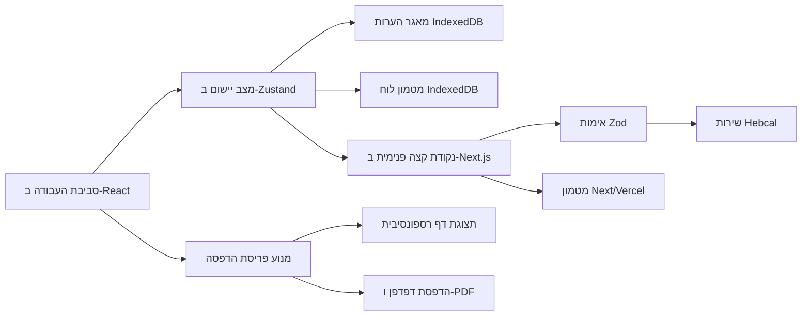

# סטודיו לוח עברי — ארכיטקטורת Next.js

## 1. מצב המסמך

- החלטת יישום: מאושרת
- סגנון ארכיטקטוני: מונולית מודולרי
- תשתית: Next.js 16 App Router,‏ React 19 ו־TypeScript במצב strict
- סביבת ריצה: Node.js 22 על Vercel
- צוות פריסה: `YakirBM2026`
- שפה וכיוון ראשיים: עברית (`he-IL`) ו־RTL

## 2. מטרת המוצר

סטודיו לוח עברי יוצר טבלאות תאריכים לועזיות ועבריות מדויקות ומותאמות
אישית, המוכנות להדפסת PDF ב־A4 או A3. היישום חייב לעבוד היטב במחשב,
בטלפון ובטאבלט, לשמור תאים שווים, למנוע טקסט קטוע, לתמוך בדף אנכי או
אופקי ולאפשר אזכורים אישיים בלי להעביר אותם לשרת.

המיגרציה מחליפה את המימוש בן הקובץ היחיד בפרויקט Next.js הניתן לתחזוקה.
אין מדובר באיפוס מוצר: ההתנהגות שכבר אומתה עבור לוח השנה, הדפסה, גלישה,
מטמון אופליין, הערות ו־RTL נשארת בסיס הקבלה.

## 3. הנחות ודרישות לא־פונקציונליות

- דפדפנים מודרניים: Chrome/Edge/Firefox 111 ומעלה, Safari 16.4 ומעלה.
- תמיכה רספונסיבית טכנית מ־320px; יעד האימות המעשי מתחיל ב־360px וכולל
  טאבלטים ומחשב.
- במבנה מובייל כל יעד מגע יהיה לפחות 44px עבור iOS ו־48px עבור Android.
- שינוי חזותי יעדכן את התצוגה ללא פעולת רשת; פעולה רשתית תציג מצב מפורש.
- טווח לוח מרבי: שלוש שנים.
- אזכורים אישיים ואירועים מיובאים הם מידע פרטי של הדפדפן.
- לא נוספים חשבון משתמש, מסד נתונים, מערכת פרסום או SDK אנליטיקה.
- הזמינות תלויה ב־Vercel וב־Hebcal; מטמון IndexedDB מאומת מספק עבודה
  מדורגת לטווחים שכבר נטענו.
- `main` הוא ענף הייצור; Vercel Preview משמש לפני מעבר לייצור.

## 4. הגישה הארכיטקטונית

המערכת תהיה מונולית מודולרי. כללי המוצר אינם תלויים ב־React או ב־Next.js;
המסגרת מספקת ניתוב, גבול שרת, metadata ופריסה.



## 5. תחומי אחריות

### תחום לוח השנה

אחראי ליישור טווח לשבועות, סדר הימים, תצוגת תאריך עברי, סיווג אירועים,
מדיניות הצגה ומודלי יום. אין בו תלות ב־React, בדפדפן או ב־Next.js.

### תחום פריסה והדפסה

אחראי למידות נייר, כיוון, חלוקה לעמודים, פרופילי צפיפות, גאומטריית תאים
שווים, התאמת גודל אוטומטית, מצב גלישה ומידע להדפסה. החישובים יהיו
פונקציות טהורות כדי שהממשק והבדיקות ישתמשו באותה לוגיקה.

### תחום נתוני הלוח

אחראי לחוזה Hebcal, שליפה בצד השרת, נרמול תשובה, timeout, שגיאות מקור
ונפילה למטמון מקומי. הממשק אינו מכיר קטגוריות גולמיות של Hebcal.

### תחום התאמה אישית

אחראי להגדרות, תבניות עיצוב, אירועים חיצוניים, הערות אישיות, מיגרציה
מ־localStorage, ייצוא/ייבוא פרויקט ואיפוס.

### תחום סביבת העבודה

אחראי להרכב רספונסיבי, טפסים, משוב מצב, מגירת ההגדרות, תצוגה מקדימה,
עורך יום, מגע ומקלדת והפעלת הדפסה.

## 6. מבנה מקור מוצע

```text
src/
  app/
    api/calendar/route.ts
    error.tsx
    globals.css
    icon.tsx
    layout.tsx
    loading.tsx
    manifest.ts
    page.tsx
  application/
    calendar/use-calendar-controller.ts
    projects/project-file.ts
  components/
    calendar/*.tsx
    editor/*.tsx
    settings/sections/*.tsx
    shell/*.tsx
    ui/*.tsx
  domain/
    calendar/*.ts
    print/*.ts
  infrastructure/
    hebcal/*.ts
    storage/*.ts
  state/
    calendar-store.ts
    settings-store.ts
  styles/
    calendar.css
    controls.css
    mobile.css
    print.css
    shell.css
tests/
  unit/
  component/
  e2e/
```

קובץ יקבל אחריות ממוקדת ובדרך כלל יישאר מתחת ל־200 שורות. ייעשה שימוש
בשמות מתחום המוצר ולא בתיקיות כלליות מסוג `utils` או `helpers`.

## 7. גבול שרת–לקוח

רכיבי Server ירנדרו metadata ואת מעטפת המסמך. סביבת העבודה האינטראקטיבית
תהיה רכיב Client משום שהיא מנהלת טפסים, IndexedDB, הדפסה בדפדפן, תיבות
דו־שיח, zoom ומצב חיבור.

`GET /api/calendar` יקבל רק `start`,‏ `end` ו־`region`. ‏Zod יאמת את
הפרמטרים. השרת ירכיב בקשת Hebcal מדויקת, יחיל timeout, ינרמל שגיאות ויחזיר
מבנה מוקלד. תשובות Hebcal יישמרו במטמון שרת עם זמן רענון מפורש. הערות,
צבעים, קובצי פרויקט והגדרות אישיות לא יישלחו לנקודת הקצה.

## 8. מצב ואחסון מקומי

- Zustand ינהל מצב עבודה והגדרות פעילות.
- הגדרות יישמרו ב־localStorage במעטפת בעלת גרסה.
- הערות ומטמון לוח יישמרו ב־IndexedDB באמצעות `idb-keyval`.
- נתוני `seder-yom-*-v1` הקיימים יועברו פעם אחת בלי למחוק את המקור עד
  לאימות ההחלפה.
- קובץ פרויקט יעבור לסכמת גרסה 2 וימשיך לקבל ייבוא מגרסה 1.
- מספר טווחי המטמון יוגבל והם יסודרו לפי זמן האימות.

## 9. מודל נייר ופריסה

| גודל | אנכי | אופקי |
|---|---:|---:|
| A4 | 210×297 מ״מ | 297×210 מ״מ |
| A3 | 297×420 מ״מ | 420×297 מ״מ |

אותו מודל מידות מניע את גודל התצוגה, גבולות CSS, בדיקת גלישה, `@page`
ובדיקות. מצב עמוד יחיד יישאר ברירת המחדל. ריבוי עמודים יופעל רק בבחירה
מפורשת. כל שבע העמודות יהיו שוות וכל שורות השבוע בעמוד יהיו שוות. המנוע
רשאי להקטין גופן עד גבול מתועד; אם תא עדיין גולש, הייצוא ייחסם והתאריכים
הבעייתיים יוצגו.

מצבי הצפיפות יהיו נקודות התחלה לבקרות ולא גאומטריה נפרדת:

- מרווחת — גופן וריווח גדולים יותר.
- מאוזנת — ברירת המחדל ללוח רגיל בן 22 שבועות.
- צפופה — גופן וריווח מופחתים לטווחים עמוסים.

תבניות עיצוב יקבעו טיפוגרפיה וצבעים. שינוי ידני לאחר בחירת תבנית יעביר
את המחוון למצב “מותאם אישית” בלי לאבד את הערכים.

## 10. מובייל ורספונסיביות

הכיוון החזותי הוא **כלי עריכה דפוסי**: סביבת עבודה עכשווית שבה הדף הפיזי
הוא העוגן הזכיר. זהות הירוק, הקלף והטיפוגרפיה העברית תישמר.

במחשב תוצג מסילת הגדרות קבועה. מתחת ל־1024px היא תהפוך למגירה מודאלית,
וב־840px ומטה למסך הגדרות מלא המודע ל־safe areas. במובייל ההגדרות
מחולקות לאקורדיונים קצרים, גלילת הרקע נעולה, קיימים Escape וכפתור סגירה
גלוי, ופעולת ההפקה נשארת קבועה באזור האגודל. שדות התאריכים עוברים לעמודה
אחת מתחת ל־480px.

טלפון וטאבלט קומפקטי עד 840px נפתחים כברירת מחדל בתצוגת שבוע קריאה ולא בדף בן 22 שבועות ממוזער.
שבעה כרטיסי יום קריאים מציגים תאריכים, אירועים ואזכורים ומאפשרים עריכה
ישירה. ניווט השבוע משתמש ביעדי מגע של 48px. סרגל תחתון המודע ל־safe areas
משאיר בהישג אגודל את ההגדרות, השבוע הקריא, הדף הפיזי והייצוא. במסך
אופקי שרוחבו 600px ומעלה מוצגים ימי השבוע בשתי עמודות; בטאבלט אנכי החל
מ־720px נעשה שימוש בשתי עמודות גם כן.

אפשר לעבור בכל עת לתצוגת הדף הפיזי המדויקת ולזום ידנית. כאשר תצוגת השבוע
פעילה, הדף הפיזי נשאר מרונדר מחוץ לאזור הנראה כדי שבדיקת התאמת הגופן
וגלישת הטקסט תישאר סמכותית; הוא inert ומוסתר מטכנולוגיות מסייעות עד
לבחירתו. CSS ההדפסה תמיד משחזר את הדף הפיזי ומסיר את ממשק המובייל. עורך
יום הוא מסך מלא בטלפון ותיבת דו־שיח במסכים גדולים. הפקדים הניידים עומדים
ביעד 48px, אזורים בטוחים נתמכים ותנועה מכבדת reduced motion.

## 11. אמינות ושגיאות

מצב החיבור יהיה `idle`,‏ `loading`,‏ `online`,‏ `cache` או `error`.
הצלחה תשמור זמן אימות ומטען. כשל רשת יטען מטמון מדויק לאותו טווח אם
קיים. פתיחה חדשה ללא חיבור וללא מטמון תחסום ייצוא ותציג פעולת ניסיון
חוזר.

ייצוא יתאפשר רק כאשר:

1. קיימים נתונים מאומתים מן הרשת או מן המטמון;
2. הטווח והמנהג לא השתנו מאז הטעינה;
3. בדיקת הפריסה הסתיימה;
4. אין אף תא גולש.

## 12. אבטחה ופרטיות

- Zod ידחה טווחים וערכי מנהג שאינם תקינים.
- בקשת המקור תורכב מערכים מותרים בלבד.
- טקסט משתמש ירונדר כטקסט React ולא כ־HTML.
- ייבוא פרויקט יוגבל בגודל ויאומת מול סכמה.
- סודות לא יקבלו קידומת `NEXT_PUBLIC_`.
- תוכן הערות אישיות לא יעזוב את הדפדפן.
- הייצור ישתמש ב־HTTPS ובכותרות אבטחה תקניות.

## 13. אסטרטגיית בדיקות

### יחידה

- יישור טווח וגבולות;
- מידות נייר וכיוון;
- חלוקה לעמודים והתאמה אוטומטית;
- מדיניות תאריך עברי ואירועים;
- תבניות ומיגרציית פרויקט.

### רכיבים

- עדכון בקרות;
- נגישות מגירת מובייל;
- מצבי חיבור;
- עריכת הערות;
- חסמי ייצוא.

### מקצה לקצה

- טעינה מקוונת רגילה;
- שנה עברית מעוברת וימי מדינה;
- מטמון אופליין ופתיחה חדשה ללא מטמון;
- A4/A3 אנכי ואופקי;
- עמוד יחיד, ריבוי מפורש וטקסט ארוך;
- טלפונים 320/360/390px, טאבלט, מחשב ומדיית הדפסה;
- היעדר שגיאות דף, קונסולה, משאבים וגלישת גוף אופקית.

## 14. פריסה

תחילה תיווצר פריסת Vercel Preview ותיבדק. מעבר לייצור יבוצע רק לאחר
lint,‏ typecheck, בדיקות, build ובדיקות דפדפן. הפרויקט ייווצר תחת
`YakirBM2026` ויחובר למאגר GitHub.

כתובת GitHub Pages הקיימת תישאר פעילה בזמן המיגרציה. לאחר אימות Vercel,
עמוד השורש הישן יהפוך להפניה לכתובת הייצור, והמימוש המקורי יישמר תחת
`legacy/` לצורכי ביקורת וחזרה לאחור.

## 15. יומן החלטות

| החלטה | חלופות | סיבה |
|---|---|---|
| מונולית מודולרי ב־App Router | מעטפת SPA; מערכת עם מסד | גבולות חזקים בלי תפעול עודף |
| Vercel לייצור | GitHub Pages סטטי | Route Handlers ו־Preview מלאים |
| צוות `YakirBM2026` | מרחב אישי | אישור מפורש של בעל המוצר |
| מידע אישי מקומי | מסד ענן | שמירת פרטיות והתנהגות קיימת |
| proxy שרת ל־Hebcal | גישה ישירה בלבד | אימות, מטמון ושגיאות אחידות |
| Zustand ומאגרים | רכיב React יחיד | מצב צפוי והתמדה מבודדת |
| IndexedDB להערות ולמטמון | localStorage בלבד | קיבולת והתנהגות אסינכרונית טובה |
| מערכת CSS ייחודית | ספריית UI כללית | שמירת זהות סביבת הדפוס |
| Preview לפני ייצור | פריסה ישירה | צמצום סיכון המיגרציה |

## 16. סיכונים ומענים

- **נסיגת הדפסה:** מודל גאומטריה יחיד ובדיקות לכל כיוון.
- **שינוי סמנטי ב־Hebcal:** נרמול מוקלד ובדיקות fixtures.
- **אי־התאמת hydration:** מצב דפדפן יאותחל רק ברכיבי Client.
- **תקלות מגירת מובייל:** בדיקות focus, גלילה, מקלדת ו־viewport.
- **אובדן מידע ישן:** מיגרציה מוסיפה ותאימות ייבוא לגרסה 1.
- **מעבר פריסה:** האתר הישן נשמר עד שאימות הייצור מסתיים.
