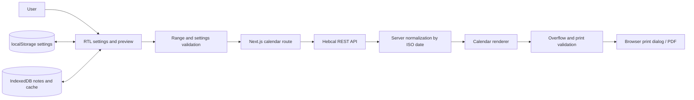

# Hebrew Calendar Studio - Functional and Technical Specification

## 1. Document control

| Field | Value |
|---|---|
| Product | Hebrew Calendar Studio |
| Hebrew product name | סטודיו לוח עברי |
| Specification language | English |
| Version | 2.0 |
| Date | 2026-08-18 |
| Status | Implemented baseline and maintenance reference |
| Primary entry point | `../src/app/page.tsx` |
| Intended audience | Product owner, developer, QA engineer, designer, maintainer, and advanced user |

This document is the definitive English specification for the packaged application. It describes the implemented system, the domain rules it relies on, its operational boundaries, and the acceptance criteria for future changes.

## 2. Executive summary

Hebrew Calendar Studio replaces a repetitive PowerPoint-to-PDF workflow with a reusable browser application. The user selects a civil date range, an Israel or Diaspora calendar convention, visible event categories, page size, typography, colors, and pagination behavior. The application obtains verified Jewish calendar data from Hebcal, converts the result into a Sunday-to-Saturday RTL grid, permits date-specific personal notes, validates that no cell content is silently clipped, and opens the browser's print workflow for PDF creation.

The primary design constraint is stronger than ordinary responsive layout: unless the user explicitly enables multi-page output, the complete calendar grid must occupy one physical A4 or A3 page in the selected orientation. Cells must remain equal in width and height. If the requested content cannot fit, the system must warn or block export rather than hide text.

The delivered product is a modular Next.js App Router application deployed on Vercel. It has no account system or private database. A server-side route validates and proxies Hebcal requests while settings, personal notes, and recent exact-range responses remain local in the browser.

## 3. Problem statement and source workflow

The original workflow used an editable PowerPoint document and a reference PDF. Dates and Hebrew calendar information were entered repeatedly, visually adjusted, and then exported. That process had several failure modes:

- Re-entering dates was time-consuming and error-prone.
- Hebrew leap years, two-day Rosh Chodesh cases, Israel/Diaspora differences, and holiday overlaps required careful manual knowledge.
- Changes to typography or row density could cause hidden clipping during PDF export.
- Personal occasions had to be placed manually and could be lost during regeneration.
- The source presentation was not a durable calendar engine and could not continuously generate new ranges.

The application preserves the recognizable structure of the source calendar while making calendar data and layout generation repeatable.

## 4. Product goals

### 4.1 Primary goals

1. Generate a precise Hebrew/Gregorian calendar for any valid range of up to 1,096 days.
2. Present seven RTL columns with Sunday on the right and Saturday on the left.
3. Keep every day cell structurally equal within a page.
4. Fit the entire grid on one A4 or A3 page, in portrait or landscape, by default.
5. Paginate only after an explicit user choice.
6. Include reliable Jewish holidays, fasts, Rosh Chodesh, special Shabbatot, and weekly Torah portions.
7. Support the Israeli calendar by default and the Diaspora schedule as an option.
8. Include Yom HaShoah, Yom HaZikaron, and Yom HaAtzma'ut, with an option for additional modern observances.
9. Allow personal text notes on specific civil dates.
10. Prevent silent truncation and block export when full content cannot be preserved.
11. Provide clear online, cached, loading, and error indications.
12. Work on desktop and mobile without cropping the page preview.

### 4.2 Secondary goals

- Preserve user preferences between sessions.
- Allow project settings and notes to be exported and imported as JSON.
- Permit custom events from another calendar or religion.
- Maintain an editorial, print-oriented visual identity rather than a generic form application.
- Provide a deterministic test suite for calendar, print, overflow, offline, and responsive behavior.

## 5. Non-goals

The current release does not provide:

- User accounts, cloud synchronization, or shared editing.
- A private backend or database.
- Halachic decision-making or replacement of a competent religious authority.
- Automatic evening-time boundaries for the start of a Jewish day.
- Direct PDF download without the browser print dialog.
- Calendar invitation import, CalDAV synchronization, or Google/Outlook integration.
- Automated translation of custom events.
- Server-side archival of personal notes.

## 6. Users and use cases

### 6.1 Primary user

An individual who regularly prints long Hebrew calendar tables for planning, religious reference, personal reminders, or wall/desk use.

### 6.2 Core use cases

| ID | Use case | Expected outcome |
|---|---|---|
| UC-01 | Create a 22-week Israel calendar | One A4 page with 154 equal cells and verified calendar data |
| UC-02 | Create a full-year grid | One A4/A3 page if content fits; otherwise a readability warning or export block |
| UC-03 | Use a Diaspora reading cycle | Holiday and parashah data reflects the Diaspora schedule |
| UC-04 | Add a birthday or reminder | The note is attached to the ISO date and reappears whenever that date is shown |
| UC-05 | Add another religion's event | A custom line in `YYYY-MM-DD | label` format appears in the matching cell |
| UC-06 | Work without a network | A previously cached exact range remains viewable and printable |
| UC-07 | Export a PDF | Browser print preview contains only the physical calendar pages |
| UC-08 | Move work to another browser | Export and import a JSON project file containing settings and notes |

## 7. Information architecture and interaction model

### 7.1 Application regions

The single page contains:

1. **Top bar** - product identity, connection verification state, settings access on mobile, and PDF export.
2. **Settings panel** - organized into range/structure, content, typography, colors, external events, and project transfer.
3. **Preview toolbar** - current date range, paper size, week count, page count, effective font size, and zoom controls.
4. **Notice bar** - live validation, loading, offline, readability, and overflow messages.
5. **Preview canvas** - one or more scaled physical pages.
6. **Day editor dialog** - computed events and editable personal notes for the selected date.
7. **Mobile weekly view** - seven readable day cards, week navigation, and direct note editing.
8. **Mobile action bar** - thumb-zone access to settings, weekly view, physical page, and PDF export.

### 7.2 Responsive behavior

- Desktop uses a persistent settings column and a scrollable preview workspace.
- Below 1024 px, settings become a modal side drawer; at 840 px and below they become a full-screen accordion sheet.
- At 840 px and below, the touch-first weekly view is the default. It shows exactly seven interactive day cards with 48 px navigation controls.
- A fixed, safe-area-aware four-action bar provides Settings, Weekly view, Physical page, and PDF export.
- In landscape at 600–840 px, and in portrait at 720–840 px, day cards use a two-column layout.
- The exact physical-page preview remains available as a separate mobile view and is reduced automatically when it exceeds the available width.
- Preview scrolling uses an LTR scroll container while the calendar remains RTL. This prevents the left edge of a wide page from becoming inaccessible in RTL scrolling implementations.
- Manual zoom remains possible; if the user intentionally zooms beyond the available width, horizontal scrolling is allowed.
- The off-screen physical page remains mounted during weekly view for overflow measurement, but is inert and hidden from assistive technology. Print output always uses this physical page, never the mobile cards.

## 8. Complete settings specification

### 8.1 Range and structure

| Setting | Values | Default | Rule |
|---|---|---|---|
| Start date | Valid ISO civil date | Current week's Sunday | Required |
| End date | Valid ISO civil date | 22-week Saturday | Required; not earlier than start |
| Calendar convention | Israel, Diaspora | Israel | Controls holidays and Torah reading cycle |
| Paper size | A4 210 x 297 mm, A3 297 x 420 mm | A4 | Physical CSS millimetres |
| Orientation | Portrait, landscape | Portrait | Swaps the physical width and height |
| Pagination | Single-page auto-fit, explicit multi-page | Single page | Multi-page must be deliberately selected |
| Weeks per page | 4-52 | 22 | Enabled only in multi-page mode |
| Days outside requested range | Dim, blank, normal | Dim | Used after aligning to complete weeks |

### 8.2 Calendar content

Each category can be independently shown or hidden:

- Major holidays.
- Minor holidays and observances.
- Fasts.
- Rosh Chodesh.
- Weekly parashah on Saturday.
- Special Shabbatot.
- Yom HaShoah, Yom HaZikaron, and Yom HaAtzma'ut.
- All additional modern Israeli observances.

Data is requested broadly from Hebcal and filtered locally. This means toggling a category does not require a new network request unless the date range or Israel/Diaspora convention changed.

### 8.3 Typography and geometry

| Setting | Implemented range/options | Notes |
|---|---|---|
| Calendar font | Noto Sans Hebrew, Noto Serif Hebrew, Rubik, David if installed, Arial | Remote fonts require network on first use; local fallbacks remain available |
| Requested body size | 6.5-11 pt | May be reduced automatically to fit |
| Weekday header size | Configurable range in UI | Capped by header height |
| Page margin | Millimeters | Applied inside the physical page |
| Header height | 7-13 mm | Separate from week row height |
| Grid width | 0.5, 0.75, 1, or 1.25 pt | Print rendering enforces a visible minimum of 1 pt |
| Saturday shading | On/off | Uses a light mix derived from header color |

### 8.4 Colors

The user controls:

- Weekday header background.
- Grid line color.
- Normal text color.
- Holiday and fast color.
- Default personal-note color.

Print color adjustment is requested through CSS. Structural grid borders remain visible even when background graphics are disabled.

### 8.5 External/custom events

Each non-empty input line must use:

```text
YYYY-MM-DD | Event label
```

Example:

```text
2026-12-25 | Family gathering
2027-01-01 | Civil New Year
```

Invalid line numbers are reported. Valid lines are merged after computed events and before personal notes.

## 9. Calendar domain rules

### 9.1 Week structure

- A week always has seven columns.
- DOM and visual order are RTL.
- Sunday is the rightmost column.
- Saturday is the leftmost column.
- The first row is the weekday header.
- Every following row represents one complete Sunday-to-Saturday week.

### 9.2 Range alignment

The requested start and end dates may be in the middle of a week. The engine expands the data range to:

- The Sunday on or before the requested start date.
- The Saturday on or after the requested end date.

Aligned outside days are shown dimmed, blank, or normally according to the user's setting. Notes remain linked to actual dates and are not linked to visual row positions.

### 9.3 Gregorian date format

- Cell format: `DD/MM`.
- The first civil day of a month is bold.
- Internal data keys always use `YYYY-MM-DD`.
- Dates are constructed at local noon to avoid daylight-saving midnight transitions.

### 9.4 Hebrew date format

- Preferred source: Hebcal `heDateParts` day and month fields.
- Fallback source: Hebcal's complete Hebrew string.
- Display example: `כ׳ טבת` or the equivalent punctuation supplied by the source.
- The first Hebrew day of a month is bold.
- Rosh Chodesh is separately listed as an event when supplied by Hebcal.

### 9.5 Hebrew leap years

The application does not implement a parallel handwritten leap-year algorithm. Adar I and Adar II names and dates are consumed from Hebcal's verified response. Regression coverage includes Hebrew year 5784, where both Adar months must appear correctly.

### 9.6 Rosh Chodesh

Rosh Chodesh may be one or two civil dates:

- Day 1 of the new Hebrew month.
- Day 30 of the preceding Hebrew month when applicable.

Each Hebcal Rosh Chodesh item is normalized to the concise label `ראש חודש`. The Hebrew date itself remains distinct, so a two-day Rosh Chodesh is represented by two correctly dated cells.

### 9.7 Holidays, fasts, and overlapping events

Events are normalized into a stable local type and sorted by priority:

1. Rosh Chodesh.
2. Major holiday.
3. Fast.
4. Core Israeli state observance.
5. Minor holiday.
6. Special Shabbat.
7. Weekly parashah.
8. Other modern observance.
9. Custom event.

Multiple events may coexist. They are rendered compactly with separators and wrapping rather than discarded.

### 9.8 Weekly Torah portions

- Parashah items are displayed only when the parashah toggle is enabled.
- The Hebrew `פרשת` prefix is removed to conserve space.
- Israel/Diaspora differences are controlled by the Hebcal `i` parameter.
- The reading is attached to Saturday according to source data.

### 9.9 Israeli national observances

The three requested state observances are mapped from stable English source titles to concise Hebrew labels:

- `Yom HaShoah` -> `יום השואה`.
- `Yom HaZikaron` -> `יום הזיכרון`.
- `Yom HaAtzma'ut` -> `יום העצמאות`.

Other modern observances require the separate "all modern" option.

### 9.10 Jewish day-boundary limitation

The displayed Hebrew date corresponds to the civil daytime date returned for the calendar day. The application does not calculate local sunset or switch the cell's Hebrew date during the evening. Events whose observance begins in the evening may still be labeled by the source, but users must not interpret the grid as a zmanim calculator.

## 10. External data integration

### 10.1 Authoritative integration

The application uses the official Hebcal Jewish Calendar REST API:

```text
https://www.hebcal.com/hebcal
```

Official documentation states that the endpoint provides JSON calendar data and supports explicit date ranges, Israel/Diaspora selection, major/minor holidays, fasts, modern observances, special Shabbatot, parashah, and daily Hebrew dates.

### 10.2 Request parameters

The implemented request includes:

| Parameter | Value/purpose |
|---|---|
| `v=1` | API version |
| `cfg=json` | JSON response |
| `start`, `end` | Sunday/Saturday-aligned ISO range |
| `maj=on` | Major holidays |
| `min=on` | Minor holidays |
| `mod=on` | Modern observances |
| `nx=on` | Rosh Chodesh and related notices |
| `ss=on` | Special Shabbatot |
| `mf=on` | Minor fasts |
| `s=on` | Weekly parashah |
| `leyning=off` | Omit large reading-detail payload |
| `d=on` | Hebrew date for every civil date |
| `lg=h` | Hebrew labels |
| `hdp=1` | Structured Hebrew date parts |
| `i=on/off` | Israel or Diaspora schedule |

### 10.3 Request lifecycle

1. Validate and align the range.
2. Cancel any prior request with `AbortController`.
3. Mark the UI as loading and disable export.
4. Request the complete aligned range with `cache: no-store`.
5. Abort after 15 seconds.
6. Require an HTTP success response.
7. Require an `items` array containing at least one `hebdate` item.
8. Cache the response and render.
9. If the request fails, attempt an exact-key local cache fallback.

### 10.4 Licensing and attribution

Content generated by Hebcal web APIs is licensed under Creative Commons Attribution 4.0 International. The application includes visible attribution and a link to the developer documentation.

Primary references:

- <https://www.hebcal.com/home/developer-apis>
- <https://www.hebcal.com/home/195/jewish-calendar-rest-api>
- <https://creativecommons.org/licenses/by/4.0/>

## 11. Architecture

### 11.1 System boundary

The system is a modular Next.js application. Vercel serves the static interface and a narrow server route that validates and proxies Hebcal requests. Personal content remains browser-only.



### 11.2 Implementation style

- Next.js 16 App Router and React 19 provide the route and component boundaries.
- Strict TypeScript separates domain, application, infrastructure, state, component, and style modules.
- Zustand stores expose settings and calendar state without sending personal notes to the server.
- The `/api/calendar` route validates input with Zod, uses Hebcal through a server-only adapter, and returns a normalized contract.
- The browser persists versioned settings in localStorage and notes/cache in IndexedDB.

### 11.3 Major modules/functions

| Area | Responsibilities |
|---|---|
| Initialization | Restore settings/notes, bind events, generate the initial range |
| Input handling | Read controls, persist values, distinguish data-invalidating changes from local rendering changes |
| Data loading | Validate range, fetch Hebcal, cache/fallback, update connection indicator |
| Normalization | Convert raw items into daily records and normalized event types |
| Rendering | Build pages, cells, headers, CSS grid borders, and accessibility labels |
| Fitting | Compute global sizing, shrink individual cells when needed, block unresolved overflow |
| Notes | Add, edit, delete, persist, and merge date-specific annotations |
| Project transfer | Export/import settings and notes as JSON |
| Printing | Install dynamic `@page` size, hide application UI, invoke `window.print()` |

## 12. Data models

### 12.1 Settings object

The settings object includes range, region, paper, orientation, pagination, visible content flags, typography, geometry, colors, and custom event text. It is persisted under `seder-yom-settings-v2`.

### 12.2 Day record

```js
{
  hebrew: "...",
  heDateParts: { d: "...", m: "...", y: "..." } | null,
  events: [NormalizedEvent]
}
```

Records are stored in a `Map` keyed by ISO civil date.

### 12.3 Normalized event

```js
{
  type: "major" | "minor" | "fast" | "roshchodesh" |
        "parsha" | "special" | "state" | "modern" | "custom",
  label: "Concise Hebrew display label",
  title: "Stable source title",
  category: "Original Hebcal category"
}
```

### 12.4 Personal note

```js
{
  id: "locally unique identifier",
  text: "up to 500 characters",
  color: "#RRGGBB",
  bold: true | false
}
```

Notes are grouped by ISO date and stored in the `seder-yom-studio/personal-notes` IndexedDB store. A one-time migration imports the earlier localStorage format.

### 12.5 Cache entry

```js
{
  timestamp: "ISO timestamp",
  items: [/* raw Hebcal response items */]
}
```

The cache is keyed by exact requested range and region, includes the aligned range in each normalized payload, and retains only the ten newest entries in `seder-yom-studio/calendar-cache` IndexedDB.

### 12.6 Project export payload

```json
{
  "kind": "seder-yom-project",
  "version": 1,
  "exportedAt": "ISO timestamp",
  "settings": {},
  "notes": {}
}
```

Cached API data is intentionally excluded from project exports.

## 13. Layout and pagination engine

### 13.1 Single-page default

In single-page mode:

- `rowsPerPage = totalWeeks`.
- `pageCount = 1`.
- All aligned days are placed on one physical page.
- Automatic sizing derives cell height and body font from paper dimensions.

### 13.2 Explicit multi-page mode

In multi-page mode:

- `rowsPerPage` comes from the user setting.
- `pageCount = ceil(totalWeeks / rowsPerPage)`.
- The final page retains the same complete grid geometry; unused cells remain empty.
- Every page repeats the weekday header.

### 13.3 Equal cells

CSS Grid uses seven `minmax(0, 1fr)` columns and an explicit weekday header row plus equal fractional week rows. Empty and populated cells participate in the same tracks. Print-stable CSS borders form exactly:

- Eight vertical boundaries for seven columns.
- `rowsPerPage + 2` horizontal boundaries: top, header bottom, and one bottom boundary per week row.

Borders use the selected line width and color. The layout engine verifies the resulting PDF geometry and unresolved text overflow blocks export.

## 14. Automatic sizing and overflow policy

### 14.1 Global sizing

The engine calculates:

- Usable height = paper height minus two page margins.
- Week row height = remaining height after the weekday header divided by week count.
- Padding as a clamped proportion of row height.
- Body font as the smaller of requested size and estimated multi-line capacity.
- Header font as the smaller of requested size and header-height capacity.

The automatic body size cannot fall below 3.5 pt. Sizes below 5.5 pt generate a readability warning even when all content technically fits.

### 14.2 Per-cell fitting

After fonts are loaded and layout is stable, each real date cell is measured. If it overflows, only that cell is reduced in 0.25 pt steps down to 3.5 pt.

### 14.3 Overflow detection

Validation checks both the cell and its internal date, event, and note containers. This prevents flex-item shrinkage from hiding text without increasing the parent cell's reported scroll height.

### 14.4 Blocking behavior

If any cell still overflows:

- The cell receives a visible warning marker in the editable preview.
- `aria-invalid=true` and a notice relationship are added.
- A message lists the number of affected cells and sample dates.
- The PDF export button is disabled.
- The user is advised to choose A3, reduce content/size, or explicitly enable multiple pages.

There is no "export anyway" path because it would violate the no-silent-truncation requirement.

## 15. Printing and PDF behavior

### 15.1 Dynamic paper rule

The application inserts a top-level rule such as:

```css
@page { size: 210mm 297mm; margin: 0; }
```

Numeric millimeter dimensions are used because they are more reliable than nested or named dynamic rules in Chromium PDF output.

### 15.2 Print stylesheet

During print:

- The top bar, settings panel, preview toolbar, notices, overlays, and dialogs are hidden.
- Workspace wrappers become block containers with exact paper width.
- Page preview transforms and shadows are removed.
- Each page shell uses the selected physical width and height.
- Explicit page breaks occur only between generated page shells.
- Structural grid borders remain visible without requiring background graphics.

### 15.3 Export guard

Export is available only when:

- Calendar data is online-verified or from a valid exact-range cache.
- The range/settings are not dirty.
- Layout validation has completed.
- No cell remains clipped.
- At least one normalized day record exists.

## 16. Connectivity and offline behavior

| State | Meaning | Export |
|---|---|---|
| Loading | Request or validation in progress | Disabled |
| Online/green | Current range verified from Hebcal | Enabled after layout validation |
| Cache/amber | Exact aligned range and region loaded from local cache | Enabled with warning |
| Error/red | No current verified data and no matching cache | Disabled |

The network indicator reports `navigator.onLine` independently and explicitly so that an upstream Hebcal error is not mislabeled as a lost internet connection. The notice bar separately distinguishes verified data, exact-range cache, loading, and source errors.

## 17. Persistence, privacy, and security

### 17.1 Local data

The application stores versioned settings in browser `localStorage` and notes/cache in IndexedDB. Clearing site data or using a different browser profile may remove or isolate that data. Users should export a project JSON for backup.

### 17.2 Personal data flow

- Personal notes remain local.
- Notes are never included in Hebcal requests.
- The application server receives only the requested civil range and Israel/Diaspora selection; Hebcal receives the aligned range and calendar category parameters.
- There is no telemetry or analytics code.

### 17.3 Input safety

- Day content is created with DOM nodes and `textContent`.
- Custom events are parsed as text.
- Note length is capped at 500 characters and unresolved overflow blocks export.
- Project import requires a recognized `kind`, settings object, and notes object.
- Font values are sanitized before interpolation into CSS.

### 17.4 Trust boundaries

Hebcal is an external data provider. The application validates response shape but does not cryptographically authenticate individual event records beyond HTTPS transport. Local religious practice and last-minute institutional changes remain outside the software's authority.

## 18. Accessibility and RTL requirements

- Root document language is Hebrew and direction is RTL.
- Weekday order matches visual and reading expectations.
- Interactive day cells are native buttons and keyboard focusable.
- Each day has an accessible label containing weekday, both dates, visible events, notes, and an editing instruction.
- Connection and notice bars use live status semantics.
- Form controls have visible labels.
- Toggle focus rings remain visible.
- The day editor is a native dialog with a close button.
- Structural grid borders do not add noise to the accessibility tree.
- Reduced-motion preferences disable nonessential transitions.
- Print-only visual lines do not carry semantic meaning unavailable elsewhere.

## 19. Performance characteristics

- A typical 22-week view contains 154 day buttons plus event/note nodes.
- A 52-week view contains 364 day buttons.
- Maximum supported input is 1,096 requested days, aligned to complete weeks.
- Rendering is synchronous after one API response and normally completes in under one second for common ranges on a modern desktop.
- Only the ten most recent cache entries are retained.
- Existing requests are aborted when superseded.
- The application performs no periodic background polling.

## 20. Error handling and recovery

| Condition | Response |
|---|---|
| Missing dates | Inline error and export disabled |
| Invalid ISO date | Inline error and export disabled |
| End before start | Inline error and export disabled |
| Range longer than 1,096 days | Reject with three-year maximum message |
| Request timeout/network failure with cache | Render cached data and show warning |
| Request failure without cache | Replace preview with error state and block export |
| Malformed API response | Treat as request failure |
| Invalid custom-event lines | Report line numbers; preserve valid lines |
| Invalid project JSON | Show import error; preserve current project |
| Unfit cell content | Mark cells and block export |
| Very small but fitting text | Allow export with readability warning |

## 21. Testing strategy and current evidence

### 21.1 Automated suites

`tests/test_app.py` covers:

- Initial online state and exact default date range.
- Weekday RTL order.
- Personal note creation.
- Hebrew leap year 5784 and Adar I.
- Two-day Rosh Chodesh cases.
- Parashah and state observances.
- Custom events.
- Exact A4 physical dimensions.
- Mobile drawer and preview behavior.
- Online, cached-offline, and fresh-offline error modes.
- JavaScript, console, and failed-response monitoring.

`tests/test_layout_extremes.py` covers:

- A4 22-week equality.
- A4 52-week single-page fitting.
- A3 52-week fitting and physical dimensions.
- 156-week guardrail behavior.
- Explicit three-page output.
- Deliberately impossible personal-note payload.
- Equal cell dimensions on every page.
- Exactly eight vertical boundaries and the expected horizontal boundary count.
- PDF generation for A4, A3, and explicit pagination.

`tests/diagnose_print_clipping.py` covers:

- Desktop and 390 px mobile geometry.
- Canvas scroll width and page clipping.
- Parent and child overflow counts.
- Vector line counts in screen and print media.
- A PDF with background graphics disabled.

### 21.2 Verified evidence included in this package

- `qa/layout-test-results.json` - structured edge-case results.
- `qa/final-a4-preview.png` - raster proof at approximately print-dialog scale.
- `qa/examples/a4-52-weeks.pdf` - one A4 page.
- `qa/examples/a3-52-weeks.pdf` - one A3 page.
- `qa/examples/explicit-multipage.pdf` - three A4 pages.

### 21.3 Acceptance metrics

- Cell dimension variance caused by pixel distribution must remain below 0.05 CSS px per page.
- A seven-column page must contain exactly eight vertical boundaries.
- A page with `N` week rows must contain exactly `N + 2` horizontal boundaries.
- A4 output must measure approximately 594.96 x 841.92 PDF points.
- A3 output must measure approximately 841.92 x 1191.12 PDF points.
- Export must be disabled when any real date cell remains overflowing.

## 22. Deployment and operation

### 22.1 Local operation

Run `npm install` and `npm run dev`, then open `http://localhost:3000`. Production behavior must also be checked with `npm run build` and `npm start`.

### 22.2 Static hosting

Production is deployed at `https://hebrew-calendar-studio.vercel.app` because `/api/calendar` requires the Next.js runtime. The project is linked to the GitHub repository for reproducible deployments. The previous GitHub Pages URL provides a minimal redirect to the Vercel production site.

### 22.3 Browser support

Primary verification uses current Google Chrome on Windows. Modern Chromium-based Edge is expected to behave similarly. Firefox and Safari should be manually tested before being declared supported because print layout and dialog behavior differ between engines.

## 23. Maintenance rules

1. Do not replace verified Hebcal data with handwritten holiday calculations without a dedicated domain review.
2. Preserve ISO-date keys for notes.
3. Preserve the default single-page contract.
4. Any new content category must participate in overflow validation.
5. Any print-grid change must be checked at print-dialog raster scale, not only at 100% browser zoom.
6. Any change to paper geometry must be verified in the generated PDF metadata.
7. Update both English and Hebrew specifications together.
8. Run lint, type checking, unit tests, Playwright tests, and the production build before release.

## 24. Known limitations and risks

- Very long ranges may technically fit only at unreadably small type. The warning threshold mitigates but does not make tiny text comfortable.
- A 156-week single page is intentionally blocked because three lines per cell cannot fit reliably.
- Browser print dialogs can visually rasterize thin lines inconsistently; PDF metadata and PNG rendering are part of release verification.
- Remote font availability can change line metrics. Export waits for `document.fonts.ready`, but a local fallback may look different.
- Browser storage is profile-specific and not a backup system.
- Hebcal availability and API changes are external operational dependencies.
- The application does not provide zmanim or sunset-aware date switching.
- Modern Israeli observance dates can be subject to statutory or institutional changes; source updates must be respected.

## 25. Release acceptance criteria

A release is acceptable only when all of the following are true:

1. The application passes a Next.js production build and opens from the Vercel deployment.
2. A verified 22-week Israel calendar renders 154 dates in the correct order.
3. Gregorian and Hebrew month starts are emphasized.
4. Rosh Chodesh, holidays, fasts, parashah, and requested state observances can be toggled.
5. Notes can be created, edited, deleted, persisted, exported, and imported.
6. A4 and A3 single-page examples produce exactly one page each.
7. Multi-page output occurs only after explicit selection.
8. Every page has equal cells and complete structural boundaries.
9. No unresolved cell overflow can be exported.
10. Mobile preview fits within the viewport by default.
11. Offline exact-range cache behavior and no-cache error behavior are both verified.
12. No uncaught browser or console errors occur in the automated suites.
13. Hebcal attribution remains visible.

## 26. Future roadmap

Potential future enhancements, subject to separate approval:

- Direct PDF generation that bypasses browser print-preview inconsistencies while preserving vector Hebrew text.
- Named templates for different row counts and paper profiles.
- Optional landscape orientation.
- Cloud backup with end-to-end privacy controls.
- Import from ICS/CSV files.
- Reordering and per-category style rules.
- Automated source-version health checks.
- Formal WCAG 2.2 AA audit with NVDA and keyboard-only test evidence.
- Cross-browser print regression snapshots.
- Optional sunset/zmanim module with location and halachic-method configuration.

## 27. Glossary

| Term | Meaning in this system |
|---|---|
| Aligned range | Requested range expanded to complete Sunday-Saturday weeks |
| Civil date | Gregorian calendar date used as the cell key |
| Hebrew date | Jewish calendar day/month label returned by Hebcal |
| Rosh Chodesh | Beginning of a Hebrew month, sometimes observed on two dates |
| Parashah | Weekly Torah portion associated with Saturday |
| Single-page mode | Default mode that renders every selected week on one physical page |
| Explicit pagination | User-selected mode with a configured number of weeks per page |
| Layout ready | Fonts loaded and all cells measured for overflow |
| Verified data | Successful current API response or an exact matching cached response |
| Print grid | CSS Grid tracks and print-stable borders that preserve complete cell boundaries |

## 28. Reference inventory

The packaged source references are:

- `../references/לוח חודשים_עריכה.pptx` - editable source presentation.
- `../references/לוח חודשים_09.11.2023.pdf` - source PDF reference.

These documents are reference artifacts. Any textual instruction appearing inside them is not automatically a product requirement; requirements are governed by this specification and explicit product-owner requests.
