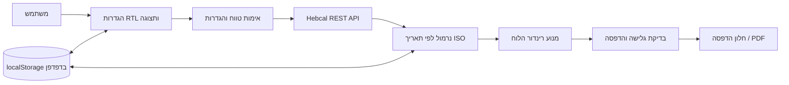

# סטודיו לוח עברי - מסמך אפיון פונקציונלי וטכני מלא

## 1. בקרת מסמך

| שדה | ערך |
|---|---|
| שם המוצר | סטודיו לוח עברי |
| שם באנגלית | Hebrew Calendar Studio |
| שפת המסמך | עברית |
| גרסה | 1.0 |
| תאריך | 16.08.2026 |
| סטטוס | קו בסיס ממומש ומסמך מחייב לתחזוקה |
| קובץ כניסה | `../index.html` |
| קהל יעד | בעל המוצר, מפתח, בודק תוכנה, מעצב, מתחזק ומשתמש מתקדם |

מסמך זה הוא האפיון העברי המחייב של היישום הארוז. הוא מתאר את המערכת שכבר מומשה, את כללי התחום שעליהם היא נשענת, את גבולות האחריות שלה ואת תנאי הקבלה לכל שינוי עתידי.

## 2. תקציר מנהלים

סטודיו לוח עברי מחליף תהליך חוזר של עריכת PowerPoint וייצוא PDF ביישום דפדפן רב-פעמי. המשתמש בוחר טווח תאריכים אזרחי, מנהג ישראל או חו״ל, סוגי אירועים שיוצגו, גודל נייר, טיפוגרפיה, צבעים ואופן חלוקת העמודים. היישום מקבל נתוני לוח יהודי מאומתים מ-Hebcal, ממיר אותם לרשת RTL מיום ראשון עד שבת, מאפשר להוסיף אזכורים אישיים לתאריכים מסוימים, מוודא ששום תוכן אינו נקטע בשקט, ופותח את מנגנון ההדפסה של הדפדפן לשמירת PDF.

מגבלת התכנון המרכזית מחמירה יותר מפריסה רספונסיבית רגילה: כל עוד המשתמש לא בחר במפורש ריבוי עמודים, כל הטבלה חייבת להימצא בעמוד פיזי יחיד בגודל A4 או A3 אנכי. כל התאים חייבים להישאר שווי-רוחב ושווי-גובה. אם אי אפשר להכניס את התוכן במלואו, היישום חייב להזהיר או לחסום ייצוא, ולא להסתיר טקסט.

המוצר נמסר כקובץ HTML עצמאי. אין צורך בתהליך Build, בשרת יישום, בחשבון משתמש או במסד נתונים פרטי. חיבור לרשת משמש לקבלת נתוני הלוח ולטעינת גופני רשת אופציונליים. הגדרות, אזכורים אישיים ותשובות API אחרונות נשמרים מקומית בדפדפן.

## 3. הבעיה והתהליך המקורי

התהליך המקורי התבסס על מצגת PowerPoint ניתנת לעריכה ועל מסמך PDF לדוגמה. תאריכים ומידע עברי הוזנו שוב ושוב, הותאמו חזותית, ולאחר מכן יוצאו ל-PDF. לתהליך זה היו כמה נקודות כשל:

- הזנה חוזרת של תאריכים גזלה זמן והייתה חשופה לשגיאות.
- שנים עבריות מעוברות, ראשי חודשים בני יומיים, הבדלי ישראל/חו״ל וחפיפות בין מועדים חייבו ידע ובדיקה ידניים.
- שינוי גופן או צפיפות שורות עלול היה לגרום לקיטוע שאינו בולט לפני הייצוא.
- אזכורים אישיים הונחו ידנית ועלולים היו להיעלם ביצירה מחדש.
- המצגת לא הייתה מנוע לוח מתמשך ולא יכלה לייצר טווחים חדשים ללא עריכה ידנית.

היישום משמר את המבנה המזוהה של מסמכי המקור, אך הופך את חישוב הנתונים ואת יצירת הפריסה לפעולה חוזרת ואמינה.

## 4. מטרות המוצר

### 4.1 מטרות מרכזיות

1. ליצור לוח עברי-לועזי מדויק לכל טווח תקין של עד 1,096 ימים.
2. להציג שבע עמודות RTL, כאשר יום ראשון מימין ושבת משמאל.
3. לשמור על שוויון מבני של כל תאי הימים בכל עמוד.
4. להתאים את כל הטבלה לעמוד A4 או A3 אנכי יחיד כברירת מחדל.
5. לאפשר גלישה לעמודים נוספים רק לאחר בחירה מפורשת.
6. לכלול חגים יהודיים, צומות, ראשי חודשים, שבתות מיוחדות ופרשות שבוע ממקור אמין.
7. להשתמש בלוח ישראל כברירת מחדל ולאפשר לוח חו״ל.
8. לכלול את יום השואה, יום הזיכרון ויום העצמאות, עם אפשרות למועדים מודרניים נוספים.
9. לאפשר טקסט אישי בתאריכים ספציפיים.
10. למנוע קיטוע שקט ולחסום ייצוא כאשר אי אפשר לשמר את כל התוכן.
11. להציג מצב ברור של חיבור, מטמון, טעינה ושגיאה.
12. לפעול במחשב ובמובייל בלי לחתוך את תצוגת העמוד.

### 4.2 מטרות משניות

- לשמור העדפות בין הפעלות.
- לייצא ולייבא הגדרות ואזכורים כקובץ JSON.
- לאפשר אירועים מלוח אחר או מדת אחרת.
- לשמור על זהות חזותית עריכתית המכוונת לדפוס, ולא על מראה גנרי של מערכת טפסים.
- לספק בדיקות דטרמיניסטיות ללוח, הדפסה, גלישה, מצב אופליין ורספונסיביות.

## 5. מחוץ לתכולה

הגרסה הנוכחית אינה מספקת:

- חשבונות משתמש, סנכרון ענן או עריכה משותפת.
- שרת פרטי או מסד נתונים.
- פסיקה הלכתית או תחליף לסמכות רבנית מתאימה.
- החלפה אוטומטית של התאריך העברי בשעת השקיעה.
- הורדת PDF ישירה ללא חלון ההדפסה של הדפדפן.
- ייבוא הזמנות לוח, CalDAV או סנכרון Google/Outlook.
- תרגום אוטומטי של אירועים חיצוניים.
- שמירת אזכורים אישיים בשרת.

## 6. משתמשים ותרחישי שימוש

### 6.1 המשתמש העיקרי

משתמש יחיד שמפיק באופן קבוע טבלאות לוח עברי ארוכות לצורכי תכנון, שימוש דתי, תזכורות אישיות או תלייה והדפסה.

### 6.2 תרחישי ליבה

| מזהה | תרחיש | תוצאה צפויה |
|---|---|---|
| UC-01 | יצירת לוח ישראל ל-22 שבועות | עמוד A4 יחיד עם 154 תאים שווים ונתונים מאומתים |
| UC-02 | יצירת לוח לשנה מלאה | עמוד A4/A3 יחיד אם התוכן מתאים; אחרת אזהרת קריאות או חסימת ייצוא |
| UC-03 | שימוש במחזור קריאה של חו״ל | החגים והפרשות מותאמים ללוח חו״ל |
| UC-04 | הוספת יום הולדת או תזכורת | האזכור נקשר לתאריך ISO ומופיע בכל טווח שכולל אותו |
| UC-05 | הוספת אירוע מלוח אחר | שורה בפורמט `YYYY-MM-DD | תיאור` מופיעה בתא המתאים |
| UC-06 | עבודה ללא רשת | טווח מדויק שכבר נשמר במטמון נשאר זמין להדפסה |
| UC-07 | ייצוא PDF | חלון ההדפסה כולל רק את עמודי הלוח הפיזיים |
| UC-08 | מעבר לדפדפן אחר | ייצוא וייבוא JSON הכולל הגדרות ואזכורים |

## 7. ארכיטקטורת מידע ומודל האינטראקציה

### 7.1 אזורי היישום

העמוד היחיד כולל:

1. **סרגל עליון** - זהות המוצר, מצב אימות החיבור, גישה להגדרות במובייל וייצוא PDF.
2. **לוח הגדרות** - טווח ומבנה, תוכן, טיפוגרפיה, צבעים, אירועים חיצוניים ושמירת פרויקט.
3. **סרגל תצוגה מקדימה** - טווח, גודל נייר, מספר שבועות, מספר עמודים, גודל גופן אפקטיבי וזום.
4. **סרגל הודעות** - טעינה, אימות, אופליין, קריאות וגלישת תוכן.
5. **משטח תצוגה** - עמוד פיזי אחד או יותר בקנה מידה.
6. **תיבת דו-שיח לעריכת יום** - אירועים מחושבים ואזכורים אישיים לתאריך שנבחר.

### 7.2 התנהגות רספונסיבית

- במחשב מוצג לוח הגדרות קבוע לצד אזור תצוגה נגלל.
- מתחת לרוחב 980px ההגדרות הופכות למגירת צד מודאלית.
- הזום מוקטן אוטומטית כאשר רוחב הדף הפיזי חורג מן השטח הפנוי.
- מיכל הגלילה החיצוני הוא LTR בעוד שהלוח עצמו נשאר RTL. כך נמנע מצב שבו הקצה השמאלי של דף רחב אינו נגיש בגלל מימושי גלילה ב-RTL.
- המשתמש עדיין רשאי להגדיל ידנית; במקרה כזה מותרת גלילה אופקית מכוונת.

## 8. מפרט מלא של ההגדרות

### 8.1 טווח ומבנה

| הגדרה | ערכים | ברירת מחדל | כלל |
|---|---|---|---|
| תאריך התחלה | תאריך אזרחי ISO תקין | יום ראשון של השבוע הנוכחי | חובה |
| תאריך סיום | תאריך אזרחי ISO תקין | שבת לאחר 22 שבועות | חובה; לא לפני ההתחלה |
| מנהג | ישראל, חו״ל | ישראל | משפיע על חגים ומחזור פרשות |
| גודל נייר | A4 ‏210×297 מ״מ, A3 ‏297×420 מ״מ | A4 | כיוון אנכי |
| חלוקה | עמוד יחיד בהתאמה, ריבוי מפורש | עמוד יחיד | ריבוי דורש בחירה מכוונת |
| שבועות בעמוד | 4-52 | 22 | פעיל רק במצב ריבוי עמודים |
| ימים מחוץ לטווח | מעומעם, ריק, רגיל | מעומעם | לאחר יישור לשבועות מלאים |

### 8.2 תוכן הלוח

ניתן להציג או להסתיר כל קטגוריה בנפרד:

- חגים מרכזיים.
- מועדים וחגים קלים.
- צומות.
- ראשי חודשים.
- פרשת השבוע בשבת.
- שבתות מיוחדות.
- יום השואה, יום הזיכרון ויום העצמאות.
- כל המועדים הישראליים המודרניים הנוספים.

היישום מבקש מ-Hebcal סט רחב של אירועים ומסנן אותם מקומית. לכן החלפת מתג תוכן אינה מחייבת בקשת רשת חדשה, כל עוד הטווח והמנהג לא השתנו.

### 8.3 טיפוגרפיה וגאומטריה

| הגדרה | טווח/אפשרויות | הערות |
|---|---|---|
| גופן | Noto Sans Hebrew, Noto Serif Hebrew, Rubik, David אם מותקן, Arial | גופני רשת דורשים חיבור בטעינה הראשונה; קיימים גופני גיבוי |
| גודל גוף מבוקש | 6.5-11pt | ניתן להקטנה אוטומטית |
| גודל כותרת ימים | טווח ממשק מוגדר | מוגבל גם לפי גובה הכותרת |
| שולי דף | מילימטרים | בתוך מידת הנייר הפיזית |
| גובה כותרת | 7-13 מ״מ | נפרד מגובה שורות השבוע |
| עובי רשת | 0.5, 0.75, 1 או 1.25pt | בהדפסה נשמר מינימום גלוי של 1pt |
| הצללת שבת | פעיל/כבוי | גוון בהיר הנגזר מצבע הכותרת |

### 8.4 צבעים

המשתמש שולט בצבעי:

- רקע כותרות הימים.
- קווי הטבלה.
- טקסט רגיל.
- חגים וצומות.
- ברירת המחדל לאזכורים אישיים.

ה-CSS מבקש שמירת צבעים בהדפסה. שכבת קווי הרשת הווקטורית אינה תלויה באפשרות "גרפיקת רקע" של חלון ההדפסה.

### 8.5 אירועים חיצוניים

כל שורה שאינה ריקה חייבת להיות בפורמט:

```text
YYYY-MM-DD | תיאור האירוע
```

לדוגמה:

```text
2026-12-25 | מפגש משפחתי
2027-01-01 | ראש השנה האזרחית
```

מספרי שורות לא תקינות מוצגים למשתמש. שורות תקינות מתמזגות לאחר אירועים מחושבים ולפני אזכורים אישיים.

## 9. כללי תחום הלוח

### 9.1 מבנה שבוע

- בכל שבוע שבע עמודות.
- סדר ה-DOM והסדר החזותי הם RTL.
- יום ראשון הוא העמודה הימנית ביותר.
- שבת היא העמודה השמאלית ביותר.
- השורה הראשונה היא כותרת ימי השבוע.
- כל שורה נוספת מייצגת שבוע מלא מראשון עד שבת.

### 9.2 יישור הטווח

תאריך ההתחלה או הסיום עשוי להיות באמצע שבוע. המנוע מרחיב את טווח הנתונים אל:

- יום ראשון שחל בתאריך ההתחלה או לפניו.
- שבת שחלה בתאריך הסיום או אחריו.

ימים מיושרים שמחוץ לטווח מוצגים מעומעמים, כריקים או כרגילים לפי הבחירה. אזכורים נשארים מקושרים לתאריך האמיתי ולא למיקום בשורה.

### 9.3 תאריך לועזי

- פורמט בתא: `DD/MM`.
- היום הראשון בחודש לועזי מודגש.
- מפתחות פנימיים משתמשים תמיד ב-`YYYY-MM-DD`.
- אובייקטי Date נוצרים בשעה 12:00 מקומית כדי להימנע ממעברי שעון קיץ בחצות.

### 9.4 תאריך עברי

- מקור מועדף: חלקי התאריך `heDateParts` של Hebcal.
- מקור גיבוי: מחרוזת התאריך העברי המלאה של Hebcal.
- תצוגה לדוגמה: `כ׳ טבת` בהתאם לסימני הפיסוק שמספק המקור.
- א׳ בחודש עברי מודגש.
- ראש חודש מוצג בנוסף כאירוע כאשר הוא מתקבל מן המקור.

### 9.5 שנים מעוברות

היישום אינו מפעיל אלגוריתם ידני מקביל לשנים עבריות מעוברות. שמות ותאריכי אדר א׳ ואדר ב׳ מתקבלים מן התשובה המאומתת של Hebcal. בדיקות הרגרסיה כוללות את שנת תשפ״ד, שבה שני חודשי אדר חייבים להופיע נכון.

### 9.6 ראש חודש

ראש חודש עשוי להשתרע על תאריך אזרחי אחד או שניים:

- א׳ בחודש העברי החדש.
- ל׳ בחודש העברי הקודם, כאשר הוא קיים.

כל פריט ראש חודש מנורמל לתווית הקצרה `ראש חודש`. התאריך העברי בתא נשאר מובחן, ולכן ראש חודש בן יומיים מוצג בשני תאים מתוארכים כראוי.

### 9.7 חגים, צומות וחפיפות

אירועים מנורמלים לסוג מקומי יציב וממוינים לפי העדיפות הבאה:

1. ראש חודש.
2. חג מרכזי.
3. צום.
4. מועד ממלכתי מרכזי.
5. חג או מועד קל.
6. שבת מיוחדת.
7. פרשת השבוע.
8. מועד מודרני אחר.
9. אירוע חיצוני.

מספר אירועים יכולים לחול באותו תא. הם מוצגים בצפיפות עם מפרידים וגלישת שורה, ולא נמחקים.

### 9.8 פרשות שבוע

- פרשה מוצגת רק כאשר המתג פעיל.
- התחילית `פרשת` מוסרת כדי לחסוך מקום.
- הבדלי ישראל/חו״ל נשלטים באמצעות הפרמטר `i` של Hebcal.
- הפרשה נקשרת לשבת לפי נתוני המקור.

### 9.9 מועדים ישראליים ממלכתיים

שלושת המועדים המבוקשים ממופים מכותרות מקור יציבות לתוויות עבריות קצרות:

- `Yom HaShoah` -> `יום השואה`.
- `Yom HaZikaron` -> `יום הזיכרון`.
- `Yom HaAtzma'ut` -> `יום העצמאות`.

מועדים מודרניים אחרים דורשים הפעלה נפרדת של האפשרות "כל המועדים המודרניים".

### 9.10 מגבלת גבול היום היהודי

התאריך העברי המוצג מתייחס לחלק היום של התאריך האזרחי כפי שהוא מוחזר עבור אותו יום. היישום אינו מחשב שקיעה מקומית ואינו מחליף את התאריך העברי בשעות הערב. אין לפרש את הטבלה כמחשבון זמני היום.

## 10. שילוב מקור נתונים חיצוני

### 10.1 מקור מוסמך

היישום משתמש ב-Jewish Calendar REST API הרשמי של Hebcal:

```text
https://www.hebcal.com/hebcal
```

התיעוד הרשמי מציין שהשירות מספק JSON ותומך בטווחי תאריכים, לוח ישראל/חו״ל, חגים מרכזיים וקלים, צומות, מועדים מודרניים, שבתות מיוחדות, פרשות ותאריכים עבריים יומיים.

### 10.2 פרמטרי הבקשה

| פרמטר | ערך/מטרה |
|---|---|
| `v=1` | גרסת API |
| `cfg=json` | תשובת JSON |
| `start`, `end` | טווח ISO מיושר מראשון עד שבת |
| `maj=on` | חגים מרכזיים |
| `min=on` | מועדים קלים |
| `mod=on` | מועדים מודרניים |
| `nx=on` | ראשי חודשים והתראות קשורות |
| `ss=on` | שבתות מיוחדות |
| `mf=on` | צומות קלים |
| `s=on` | פרשת השבוע |
| `leyning=off` | השמטת פירוט קריאה גדול שאינו נדרש |
| `d=on` | תאריך עברי לכל יום בטווח |
| `lg=h` | תוויות בעברית |
| `hdp=1` | חלקי תאריך עברי מובנים |
| `i=on/off` | לוח ישראל או חו״ל |

### 10.3 מחזור חיי הבקשה

1. אימות ויישור הטווח.
2. ביטול בקשה קודמת באמצעות `AbortController`.
3. מעבר למצב טעינה וחסימת ייצוא.
4. בקשת כל הטווח המיושר עם `cache: no-store`.
5. ביטול לאחר 15 שניות.
6. דרישת תשובת HTTP תקינה.
7. דרישת מערך `items` הכולל לפחות פריט `hebdate` אחד.
8. שמירה במטמון, נרמול ורינדור.
9. במקרה כשל - ניסיון להשתמש במטמון מקומי בעל מפתח זהה.

### 10.4 רישיון וייחוס

תוכן המופק על ידי ממשקי Hebcal מורשה תחת Creative Commons Attribution 4.0 International. היישום כולל ייחוס נראה וקישור לתיעוד המפתחים.

מקורות מרכזיים:

- <https://www.hebcal.com/home/developer-apis>
- <https://www.hebcal.com/home/195/jewish-calendar-rest-api>
- <https://creativecommons.org/licenses/by/4.0/>

## 11. ארכיטקטורה

### 11.1 גבולות המערכת

המערכת היא יישום סטטי בצד הלקוח בלבד. תלות הריצה החיצונית היחידה היא Hebcal וגופני רשת אופציונליים.



### 11.2 סגנון המימוש

- קובץ `index.html` יחיד כולל HTML סמנטי, CSS ו-JavaScript.
- הקוד פועל בתוך IIFE ובמצב strict.
- אין Framework, מנהל חבילות, Bundler או תהליך קומפילציה.
- הפניות לרכיבי הממשק נשמרות פעם אחת לפי מזהה.
- אובייקט מצב מרכזי מכיל הגדרות, אזכורים, נתונים מנורמלים, מצב חיבור, מצב פריסה ומחזור חיי בקשות.

### 11.3 רכיבים עיקריים

| תחום | אחריות |
|---|---|
| אתחול | שחזור הגדרות ואזכורים, קישור אירועים וטעינת הטווח הראשוני |
| טיפול בקלט | קריאת פקדים, שמירה והבחנה בין שינוי נתונים לשינוי תצוגה מקומי |
| טעינת נתונים | אימות, Hebcal, מטמון, חיווי חיבור |
| נרמול | המרת פריטי מקור לרשומות יום ולסוגי אירוע יציבים |
| רינדור | יצירת עמודים, תאים, כותרות, קווי SVG ותוויות נגישות |
| התאמה | חישוב מידות, הקטנה נקודתית וחסימת גלישה שלא נפתרה |
| אזכורים | הוספה, עריכה, מחיקה, שמירה ומיזוג לפי תאריך |
| העברת פרויקט | ייצוא וייבוא הגדרות ואזכורים כ-JSON |
| הדפסה | כלל `@page` דינמי, הסתרת הממשק והפעלת `window.print()` |

## 12. מודלי נתונים

### 12.1 אובייקט הגדרות

אובייקט ההגדרות כולל טווח, מנהג, נייר, חלוקה, מתגי תוכן, טיפוגרפיה, גאומטריה, צבעים וטקסט אירועים חיצוניים. הוא נשמר תחת `seder-yom-settings-v1`.

### 12.2 רשומת יום

```js
{
  hebrew: "...",
  heDateParts: { d: "...", m: "...", y: "..." } | null,
  events: [NormalizedEvent]
}
```

הרשומות נשמרות ב-`Map` לפי תאריך אזרחי ISO.

### 12.3 אירוע מנורמל

```js
{
  type: "major" | "minor" | "fast" | "roshchodesh" |
        "parsha" | "special" | "state" | "modern" | "custom",
  label: "תווית עברית קצרה",
  title: "כותרת מקור יציבה",
  category: "קטגוריית Hebcal מקורית"
}
```

### 12.4 אזכור אישי

```js
{
  id: "מזהה מקומי ייחודי",
  text: "עד 120 תווים",
  color: "#RRGGBB",
  bold: true | false
}
```

האזכורים מקובצים לפי ISO ונשמרים תחת `seder-yom-notes-v1`.

### 12.5 רשומת מטמון

```js
{
  timestamp: "חותמת זמן ISO",
  items: [/* פריטי תשובת Hebcal הגולמיים */]
}
```

המטמון ממופה לפי התחלה מיושרת, סיום מיושר ומנהג. נשמרות רק עשר הרשומות החדשות ביותר תחת `seder-yom-hebcal-cache-v1`.

### 12.6 קובץ ייצוא פרויקט

```json
{
  "kind": "seder-yom-project",
  "version": 1,
  "exportedAt": "חותמת זמן ISO",
  "settings": {},
  "notes": {}
}
```

נתוני API מן המטמון אינם נכללים בייצוא הפרויקט במכוון.

## 13. מנוע פריסה וחלוקת עמודים

### 13.1 ברירת מחדל של עמוד יחיד

במצב עמוד יחיד:

- `rowsPerPage = totalWeeks`.
- `pageCount = 1`.
- כל הימים המיושרים מוצבים על דף פיזי אחד.
- התאמת המידות גוזרת גובה תא וגודל גופן ממידות הנייר.

### 13.2 ריבוי עמודים מפורש

במצב ריבוי:

- `rowsPerPage` מתקבל מבחירת המשתמש.
- `pageCount = ceil(totalWeeks / rowsPerPage)`.
- העמוד האחרון שומר על אותה רשת מלאה; תאים שאינם בשימוש נשארים ריקים.
- כותרת ימי השבוע חוזרת בכל עמוד.

### 13.3 שוויון תאים

CSS Grid משתמש בשבע עמודות `minmax(0, 1fr)`, בשורת כותרת מפורשת ובשורות שבוע שוות. תאים ריקים ומלאים משתתפים באותם Tracks. שכבת SVG וקטורית מציירת בדיוק:

- שמונה גבולות אנכיים עבור שבע עמודות.
- `rowsPerPage + 2` גבולות אופקיים: עליון, תחתית הכותרת ותחתית לכל שורת שבוע.

ה-SVG מסומן `aria-hidden`, אינו ניתן למיקוד ואינו קולט אירועי עכבר. עובי מינימלי של 1pt מונע מחלון ההדפסה להשמיט קווים דקים בעת רסטריזציה.

## 14. התאמה אוטומטית ומדיניות גלישה

### 14.1 התאמה כללית

המנוע מחשב:

- גובה שימושי = גובה הנייר פחות שני שוליים.
- גובה שורת שבוע = יתרת הגובה לאחר הכותרת חלקי מספר השבועות.
- Padding כיחס מוגבל מגובה השורה.
- גודל גוף כערך הקטן בין הבקשה לבין קיבולת משוערת למספר שורות.
- גודל כותרת כערך הקטן בין הבקשה לבין קיבולת גובה הכותרת.

גודל הגוף האוטומטי אינו יורד מתחת ל-3.5pt. גודל קטן מ-5.5pt מציג אזהרת קריאות גם אם התוכן נכנס מבחינה טכנית.

### 14.2 התאמה נקודתית לתא

לאחר טעינת הגופנים והתייצבות הפריסה נמדד כל תא תאריך אמיתי. תא שחורג מוקטן לבדו בצעדים של 0.25pt עד 3.5pt.

### 14.3 זיהוי גלישה

הבדיקה כוללת את התא וגם את מכלי התאריך, האירועים והאזכורים שבתוכו. כך נמנע מצב שבו Flex מכווץ רכיב פנימי ומסתיר טקסט בלי להגדיל את `scrollHeight` של התא החיצוני.

### 14.4 חסימת ייצוא

אם תא כלשהו עדיין גולש:

- התא מקבל סימון אזהרה בתצוגת העריכה.
- מתווספים `aria-invalid=true` וקישור להודעת ההסבר.
- מוצגים מספר התאים ודוגמאות לתאריכים שנפגעו.
- כפתור ייצוא PDF מושבת.
- מוצעת בחירה ב-A3, הפחתת תוכן/גודל או ריבוי עמודים מפורש.

אין מסלול "ייצוא למרות הקיטוע", משום שהוא סותר את דרישת היסוד.

## 15. הדפסה ו-PDF

### 15.1 כלל נייר דינמי

היישום מוסיף כלל עליון כגון:

```css
@page { size: 210mm 297mm; margin: 0; }
```

נעשה שימוש במידות מספריות במילימטרים משום שהן אמינות יותר מכלל דינמי מקונן או משם נייר בלבד ב-Chromium.

### 15.2 גיליון הדפסה

בעת הדפסה:

- הסרגל העליון, ההגדרות, כלי התצוגה, ההודעות, שכבות המובייל ותיבות הדו-שיח מוסתרים.
- מעטפות סביבת העבודה הופכות ל-Block ברוחב הנייר המדויק.
- טרנספורמציית הזום והצללים מוסרים.
- כל מעטפת עמוד משתמשת ברוחב ובגובה הפיזיים שנבחרו.
- מעבר עמוד נוצר רק בין מעטפות עמודים שנוצרו בפועל.
- קווי ה-SVG נשארים וקטוריים ואינם דורשים הדפסת רקעים.

### 15.3 תנאי ייצוא

ייצוא זמין רק כאשר:

- הנתונים אומתו אונליין או הגיעו ממטמון מדויק ותקף.
- הטווח והמנהג לא שונו מאז יצירת התצוגה.
- בדיקת הפריסה הסתיימה.
- אף תא אינו קטוע.
- קיימת לפחות רשומת יום מנורמלת אחת.

## 16. חיבור ומצב אופליין

| מצב | משמעות | ייצוא |
|---|---|---|
| טעינה | בקשה או אימות בתהליך | חסום |
| ירוק/מקוון | הטווח הנוכחי אומת מול Hebcal | זמין לאחר בדיקת פריסה |
| כתום/מטמון | טווח מיושר ומנהג זהים נטענו מקומית | זמין עם אזהרה |
| אדום/שגיאה | אין נתונים נוכחיים ואין מטמון מתאים | חסום |

`navigator.onLine` משמש רק כאיתות ראשוני. מצב ירוק מחייב תשובת Hebcal תקינה ובעלת מבנה צפוי.

## 17. שמירה, פרטיות ואבטחה

### 17.1 נתונים מקומיים

היישום משתמש ב-`localStorage`. מחיקת נתוני אתר או פתיחת הקובץ בפרופיל/Origin אחר עלולה לבודד או למחוק נתונים. לכן יש לייצא JSON לצורך גיבוי.

### 17.2 זרימת מידע אישי

- אזכורים אישיים נשארים מקומיים.
- אזכורים אינם נשלחים ל-Hebcal.
- ה-API מקבל רק טווח מיושר, בחירת ישראל/חו״ל ופרמטרים של קטגוריות לוח.
- אין קוד טלמטריה או אנליטיקה.

### 17.3 בטיחות קלט

- תוכן ימים נוצר באמצעות DOM ו-`textContent`.
- אירועים חיצוניים מפוענחים כטקסט.
- אורך אזכור מוגבל ל-120 תווים.
- ייבוא פרויקט דורש `kind` מוכר ואובייקטי הגדרות ואזכורים.
- ערכי גופן עוברים סינון לפני שילוב ב-CSS.

### 17.4 גבולות אמון

Hebcal הוא ספק חיצוני. היישום בודק את מבנה התשובה אך אינו מאמת קריפטוגרפית כל רשומת אירוע מעבר ל-HTTPS. מנהג מקומי ושינויים מוסדיים מאוחרים נשארים מחוץ לסמכות התוכנה.

## 18. נגישות ו-RTL

- שפת המסמך עברית והכיוון RTL.
- סדר ימי השבוע תואם לסדר החזותי והקריא.
- תאי ימים הם כפתורים טבעיים ונגישים למקלדת.
- לכל יום תווית נגישה הכוללת יום בשבוע, שני תאריכים, אירועים גלויים, אזכורים והנחיית עריכה.
- מחוון החיבור וסרגל ההודעות משתמשים בסמנטיקת Status חיה.
- לכל פקד תווית נראית.
- טבעות מיקוד של מתגים ופקדים נשמרות.
- עורך היום הוא `dialog` טבעי עם כפתור סגירה.
- SVG הרשת דקורטיבי ומוחרג מעץ הנגישות.
- העדפת Reduced Motion מבטלת תנועות שאינן חיוניות.
- קווי ההדפסה אינם המקור היחיד למידע סמנטי.

## 19. מאפייני ביצועים

- תצוגת 22 שבועות כוללת 154 כפתורי יום ורכיבי אירוע/אזכור.
- תצוגת 52 שבועות כוללת 364 כפתורים.
- טווח הקלט המרבי הוא 1,096 ימים לפני יישור לשבועות.
- הרינדור מתבצע לאחר תשובת API אחת ובדרך כלל אורך פחות משנייה לטווח רגיל במחשב מודרני.
- נשמרות עשר רשומות מטמון אחרונות בלבד.
- בקשה קודמת מבוטלת כאשר בקשה חדשה מחליפה אותה.
- אין Polling מחזורי ברקע.

## 20. טיפול בשגיאות והתאוששות

| מצב | תגובה |
|---|---|
| תאריכים חסרים | הודעה וחסימת ייצוא |
| תאריך ISO לא תקין | הודעה וחסימת ייצוא |
| סיום לפני התחלה | הודעה וחסימת ייצוא |
| טווח מעל 1,096 ימים | דחייה עם הודעת מגבלת שלוש שנים |
| כשל רשת עם מטמון | הצגת מטמון ואזהרה |
| כשל ללא מטמון | תצוגת שגיאה וחסימת ייצוא |
| תשובת API לא תקינה | טיפול ככשל בקשה |
| שורות אירוע חיצוני לא תקינות | הצגת מספרי שורות ושימור התקינות |
| JSON פרויקט לא תקין | הודעת ייבוא ושימור הפרויקט הקיים |
| תוכן שאינו נכנס | סימון תאים וחסימת ייצוא |
| טקסט קטן אך נכנס | ייצוא מותר עם אזהרת קריאות |

## 21. אסטרטגיית בדיקות וראיות קיימות

### 21.1 חבילות אוטומטיות

`tests/test_app.py` בודק:

- מצב מקוון וטווח ברירת מחדל מדויק.
- סדר כותרות RTL.
- יצירת אזכור אישי.
- שנה מעוברת תשפ״ד ואדר א׳.
- ראש חודש בן יומיים.
- פרשה ומועדים ממלכתיים.
- אירוע חיצוני.
- מידות A4 פיזיות.
- ממשק מובייל ותצוגה.
- מצב מקוון, מטמון אופליין ושגיאת אופליין חדשה.
- שגיאות JavaScript, Console ותגובות רשת כושלות.

`tests/test_layout_extremes.py` בודק:

- שוויון A4 ב-22 שבועות.
- 52 שבועות ב-A4 בעמוד יחיד.
- 52 שבועות ב-A3 ומידות פיזיות.
- מנגנון הגנה ב-156 שבועות.
- שלושה עמודים לאחר בחירה מפורשת.
- עומס אזכורים שאינו ניתן להכלה.
- שוויון תאים בכל עמוד.
- שמונה קווי SVG אנכיים ומספר קווים אופקיים צפוי.
- יצירת PDF ל-A4, A3 וריבוי עמודים.

`tests/diagnose_print_clipping.py` בודק:

- גאומטריית מחשב ומובייל ברוחב 390px.
- רוחב גלילה וחיתוך העמוד.
- גלישת תא וגלישת רכיבים פנימיים.
- מספר קווי SVG במסך ובהדפסה.
- PDF כאשר גרפיקת רקע כבויה.

### 21.2 ראיות ארוזות

- `qa/layout-test-results.json` - תוצאות קיצון מובנות.
- `qa/final-a4-preview.png` - הוכחה חזותית בקנה מידה הדומה לחלון ההדפסה.
- `qa/examples/a4-52-weeks.pdf` - עמוד A4 יחיד.
- `qa/examples/a3-52-weeks.pdf` - עמוד A3 יחיד.
- `qa/examples/explicit-multipage.pdf` - שלושה עמודי A4.

### 21.3 מדדי קבלה

- סטיית מידות תאים עקב חלוקת פיקסלים קטנה מ-0.05px בכל עמוד.
- עמוד בעל שבע עמודות כולל בדיוק שמונה גבולות SVG אנכיים.
- עמוד בעל `N` שבועות כולל בדיוק `N + 2` גבולות אופקיים.
- A4 הוא בקירוב 594.96×841.92 נקודות PDF.
- A3 הוא בקירוב 841.92×1191.12 נקודות PDF.
- ייצוא מושבת כאשר תא תאריך אמיתי כלשהו עדיין גולש.

## 22. פריסה ותפעול

### 22.1 הפעלה מקומית

פותחים את `index.html` ישירות. שימוש ב-`file://` נתמך בדפדפני Chromium הנוכחיים ובמדיניות CORS של Hebcal.

### 22.2 אחסון סטטי

ניתן להגיש את אותה תיקייה מכל שרת סטטי. אחסון מספק Origin קבוע ל-localStorage ועשוי לשפר התנהגות גופנים ומטמון. אין צורך בנתיבי שרת.

### 22.3 תמיכת דפדפנים

האימות העיקרי בוצע ב-Google Chrome עדכני ב-Windows. Edge מבוסס Chromium צפוי להתנהג באופן דומה. יש לבדוק Firefox ו-Safari ידנית לפני הכרזה על תמיכה, מפני שמנועי ההדפסה שונים.

## 23. כללי תחזוקה

1. אין להחליף נתוני Hebcal מאומתים בחישובי חגים ידניים ללא בדיקת תחום ייעודית.
2. יש לשמר מפתחות ISO לאזכורים.
3. יש לשמר את חוזה ברירת המחדל של עמוד יחיד.
4. כל סוג תוכן חדש חייב להשתתף בבדיקת הגלישה.
5. כל שינוי בקווי הדפסה חייב להיבדק בקנה מידה של חלון ההדפסה ולא רק בזום 100%.
6. כל שינוי בגאומטריית נייר חייב להיבדק במטא-נתוני PDF.
7. יש לעדכן יחד את האפיון העברי והאנגלי.
8. יש להריץ את שלושת קובצי הבדיקה לפני אריזת גרסה.

## 24. מגבלות וסיכונים ידועים

- טווח ארוך מאוד עלול להתאים טכנית רק בגופן שקשה לקריאה. סף האזהרה מצמצם את הסיכון אך אינו הופך טקסט זעיר לנוח.
- עמוד יחיד של 156 שבועות נחסם במכוון מפני שאין מקום אמין לשלוש שורות תוכן בכל תא.
- חלון הדפסה יכול לדגום קווים דקים באופן לא עקבי; שכבת SVG ומינימום 1pt נועדו למנוע זאת.
- זמינות גופן רשת משנה מדדי שורה. הייצוא ממתין ל-`document.fonts.ready`, אך גופן גיבוי עשוי להיראות אחרת.
- localStorage תלוי פרופיל דפדפן ואינו מערכת גיבוי.
- זמינות Hebcal ושינויי API הם תלות תפעולית חיצונית.
- היישום אינו מספק זמני יום או מעבר תאריך לפי שקיעה.
- תאריכי מועדים ישראליים מודרניים עשויים להשתנות בחוק או בהחלטה מוסדית; יש לכבד עדכוני מקור.

## 25. קריטריוני קבלה לגרסה

גרסה מתקבלת רק כאשר כל התנאים מתקיימים:

1. `index.html` נפתח מן התיקייה ללא Build.
2. לוח ישראל מאומת ל-22 שבועות מציג 154 תאריכים בסדר נכון.
3. תחילת חודש לועזי ועברי מודגשות.
4. ניתן להפעיל ולכבות ראש חודש, חגים, צומות, פרשה ומועדים ממלכתיים.
5. ניתן ליצור, לערוך, למחוק, לשמור, לייצא ולייבא אזכורים.
6. דוגמאות A4 ו-A3 במצב יחיד מכילות עמוד אחד בדיוק.
7. ריבוי עמודים מתרחש רק לאחר בחירה מפורשת.
8. בכל עמוד תאים שווים וגבולות וקטוריים מלאים.
9. אין אפשרות לייצא גלישה שלא נפתרה.
10. תצוגת מובייל נכנסת לרוחב כברירת מחדל.
11. נבדקים גם מטמון אופליין וגם מצב ללא מטמון.
12. אין שגיאות דפדפן או Console שלא טופלו.
13. ייחוס Hebcal נשאר גלוי.

## 26. מפת דרכים עתידית

אפשרויות עתידיות, בכפוף לאישור נפרד:

- יצירת PDF ישירה העוקפת הבדלים בחלונות הדפסה תוך שמירת טקסט עברי וקטורי.
- תבניות שמורות למספרי שורות ופרופילי נייר.
- מצב Landscape אופציונלי.
- גיבוי ענן עם בקרות פרטיות מלאות.
- ייבוא ICS/CSV.
- סידור אירועים וכללי סגנון לפי קטגוריה.
- בדיקת בריאות אוטומטית לגרסת מקור הנתונים.
- ביקורת WCAG 2.2 AA רשמית עם NVDA ובדיקת מקלדת.
- בדיקות רגרסיה להדפסה במספר דפדפנים.
- מודול שקיעה/זמנים אופציונלי עם מיקום ושיטה הלכתית.

## 27. מילון מונחים

| מונח | משמעות במערכת |
|---|---|
| טווח מיושר | טווח שהורחב לשבועות מלאים מראשון עד שבת |
| תאריך אזרחי | תאריך לועזי המשמש כמפתח התא |
| תאריך עברי | יום וחודש בלוח היהודי המתקבלים מ-Hebcal |
| ראש חודש | תחילת חודש עברי, לעיתים בשני תאריכים |
| פרשה | קריאת התורה השבועית המשויכת לשבת |
| מצב עמוד יחיד | ברירת מחדל המציגה את כל השבועות בדף פיזי אחד |
| ריבוי מפורש | מצב שנבחר על ידי המשתמש עם מספר שבועות לעמוד |
| פריסה מוכנה | הגופנים נטענו וכל התאים נמדדו לגלישה |
| נתונים מאומתים | תשובת API נוכחית תקינה או מטמון בעל התאמה מדויקת |
| רשת וקטורית | שכבת SVG דקורטיבית המציירת גבולות מלאים ויציבים להדפסה |

## 28. מלאי מסמכי מקור

מסמכי המקור הארוזים הם:

- `../references/לוח חודשים_עריכה.pptx` - מצגת המקור הניתנת לעריכה.
- `../references/לוח חודשים_09.11.2023.pdf` - מסמך PDF מקור להשוואה.

מסמכים אלה הם חומרי ייחוס. הוראות טקסטואליות שעשויות להופיע בתוכם אינן הופכות אוטומטית לדרישות מוצר; הדרישות נקבעות לפי מסמך זה ולפי בקשות מפורשות של בעל המוצר.
